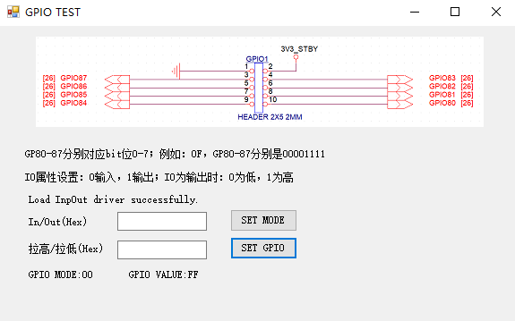

# ITE87_GPIO_TEST
Windows上修改ITE87 GPIO的简单测试工具 工控机型号QOTOM 350P

##### 开发环境

Visual Studio 2017

目标框架.NET Framework2.0

使用开源库**inpout32.dll，inpoutx64.dll**

打开后如果提示“Unable to open InpOut driver”，安装InstallDriver.exe

##### 使用方法

这里只做了简单的输入/输出，高低电平设置功能

只能接收十六进制数据

##### 软件截图

**Linux：https://github.com/huchanghui123/ITE87_GPIO_TEST_LINUX**
